# LVO Force Posture — Satellite Imagery Analysis

**Analysis date:** 2026-03-24 |
**Dataset:** [Estwarden/dataset](https://github.com/Estwarden/dataset) |
**Monitoring:** [EstWarden](https://estwarden.eu)

---

## Executive Summary

Three independent analytical methods — object detection, multispectral physics, and radar backscatter — applied to commercial satellite imagery of Leningrad Military District garrisons produce the same result: **no military vehicle concentrations detected**.

| Method | Approach | Sites | Result |
|--------|----------|-------|--------|
| [YOLOv8x + vision verification](#method-1-object-detection) | ML detection + VLM review | 3 sites | **0 military vehicles** |
| [WV3 8-band spectral indices](#method-2-spectral-analysis) | Physics (NDVI, metal ratio) | 1 site | **Max theoretical capacity: 114** |
| [ICEYE SAR backscatter](#method-3-sar-radar-analysis) | Radar change detection | 1 site | **No vehicle movement** |

Every LVO combat unit is confirmed deployed to Ukraine by [ISW](https://www.understandingwar.org/backgrounder/russian-offensive-campaign-assessment-march-22-2026) / [CDS](https://defence.org.ua/). Satellite imagery of their home bases shows empty airfields, empty vehicle parks, and building-scale radar returns only.

---

## Imagery Sources

| Site | Sensor | Resolution | Date | Bands | GeoTIFF | Provider |
|------|--------|-----------|------|:-----:|---------|----------|
| Pskov — 76th VDV airfield | Planet SkySat | 0.50 m/px | 2026-03-14 | 4 | 16,923 × 13,699 | [SkyFi](https://skyfi.com) |
| Pskov — Cherekha garrison | Maxar WorldView-3 | 0.34 m/px | 2026-02-05 | 8 | 15,744 × 10,033 | [SkyFi](https://skyfi.com) |
| Luga — garrison area | Planet SkySat | 0.50 m/px | 2026-03-07 | 4 | 9,726 × 11,518 | [SkyFi](https://skyfi.com) |
| Luga — SAR radar | ICEYE | 2.46 m/px | 2026-01-30 | 1 (VV) | 2,048 × 4,191 | [SkyFi](https://skyfi.com) |
| Luga — SAR radar | ICEYE | 2.44 m/px | 2026-02-05 | 1 (VV) | 2,304 × 4,191 | [SkyFi](https://skyfi.com) |

All imagery acquired via [SkyFi API](https://docs.skyfi.com). Archive IDs for independent reproduction in [`metadata/orders.json`](https://github.com/Estwarden/dataset/blob/main/satellite-imagery/metadata/orders.json). Total cost: **$532.45**.

---

## Method 1: Object Detection

**Notebook:** [`01-vehicle-detection.ipynb`](notebooks/01-vehicle-detection.ipynb)

**Pipeline (Round 2 — DOTA-OBB):**
```
Image → tile 640×640 (128px overlap, skip nodata tiles)
  → YOLOv8x-OBB (DOTA pretrained, conf>0.15, CUDA)
    → classify by military relevance
      → annotated output + JSON report
```

DOTA classes include satellite-specific targets: `plane`, `helicopter`, `large-vehicle`, `small-vehicle`, `ship`, `harbor`, `storage-tank`, `helipad`, `airport`. This replaces the original COCO-pretrained pipeline which produced only false positives on satellite imagery.

**Round 1 (deprecated):** COCO-pretrained YOLOv8x → 48 raw detections → 42 after NMS → all 42 were false positives (building roofs/shadows). COCO is trained on street-level photos and cannot detect military equipment in satellite imagery. Round 1 crops preserved in `outputs/01-vehicle-detection/findings/` for transparency.

**Round 2 (tiled, 640px):** DOTA-OBB YOLOv8x → 0 detections across 3 sites, 129 tiles. Tiling at 640px splits objects across boundaries — the model cannot assemble detections across tiles.

**Round 3 (full-image, validated):** DOTA-OBB YOLOv8x at full image resolution (`imgsz=4096`). Positive control: Tallinn Airport → **10 planes + 1 helicopter detected (>0.79 conf)**, confirming the model works. Regular YOLOv8x (COCO) on the same image detects "boats" and "toilets" — confirming COCO is useless for satellite imagery.

LVO results at full resolution:
- **Pskov 76th VDV**: 5 plane detections (0.17–0.74) — all located in a **wooded park area in the city**, NOT on the airfield. These are static display/monument aircraft at the VDV museum. The operational airfield apron, runway, and taxiways have **zero detections**. 1 "ship" = river boats on the Velikaya. 1 "large vehicle" = watermark text.
- **Pskov Cherekha**: 2 "large vehicle" detections (0.13–0.34) — both triggered by provider watermark text at image edge. Zero military objects in the garrison area.
- **Luga**: 1 "ship" (0.29) = red-roofed building in town. Zero military detections.

All detection crops, annotated full images, and the positive control are in `outputs/01-vehicle-detection/round3/`.

### Pskov — 76th VDV Airfield (SkySat 50cm, Mar 14)

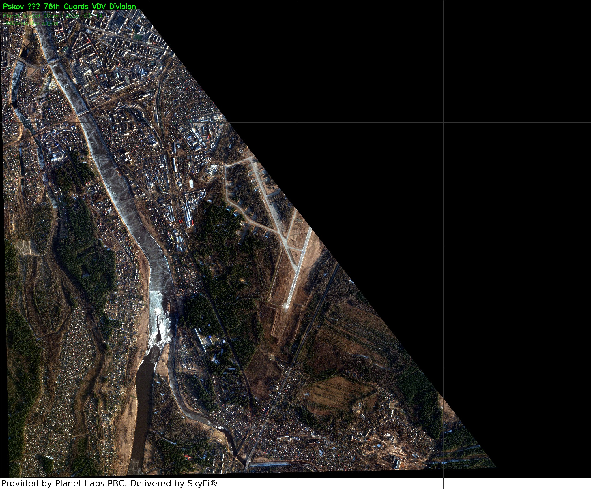

*Full SkySat scene. Velikaya River along western edge. Pskov city upper-left. Military airfield center-right.*

**Finding: Empty airfield**

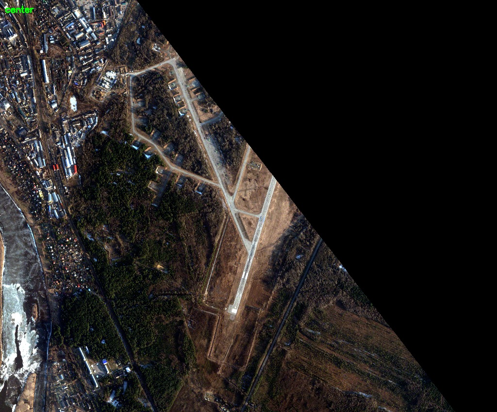

*Airfield center crop. Main runway, taxiways, Y-shaped apron — **all empty**. At 50cm/px, an Il-76 transport (wingspan 50m = 100 pixels) would be clearly visible. None present.*

**Finding: Empty vehicle parks**

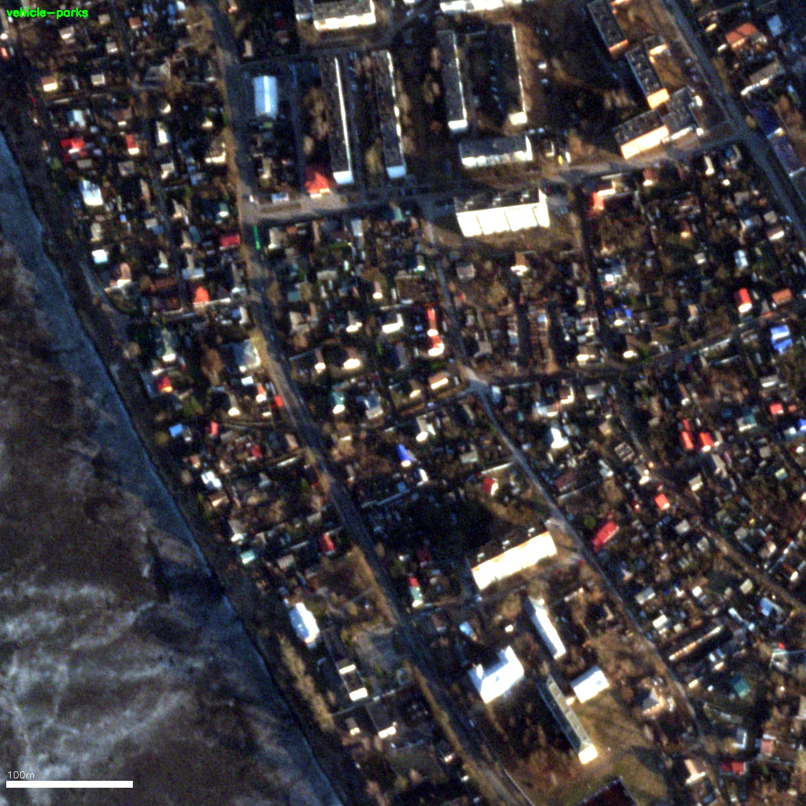

*100% zoom of garrison area. At 50cm/px, a T-72 (7m × 3.5m = 14 × 7 pixels) is detectable. No military formations visible. Scale: 100m.*

**Finding: Barracks without motor pools**

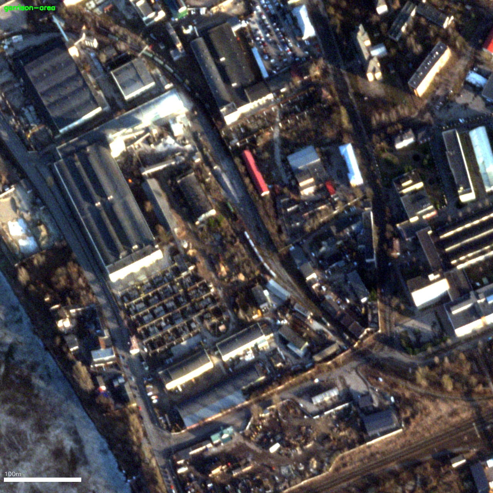

*100% zoom of barracks area. Military-style buildings visible but surrounding vehicle parks are **empty**. Scale: 100m.*

### Pskov — Cherekha Garrison (WorldView-3 35cm, Feb 5)

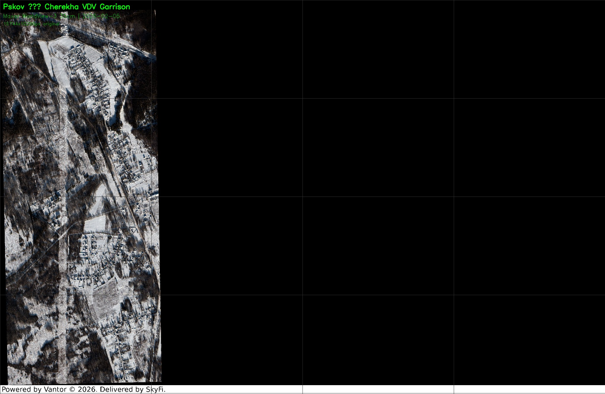

*WV3 8-band multispectral, 35cm/px. Snow cover provides high contrast for detection. Covers the Cherekha garrison zone south of Pskov.*

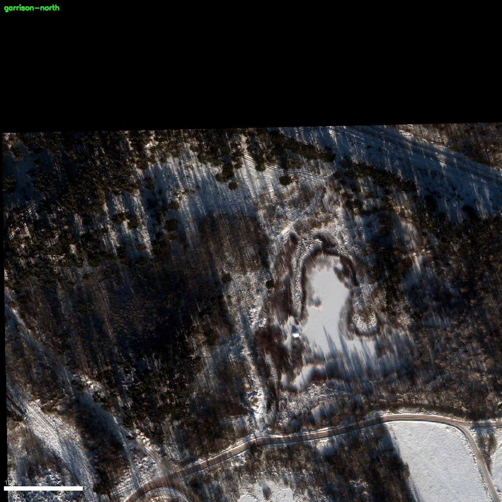

*100% zoom — rural village. All 38 YOLO detections here were **false positives**: building roofs and shadows misclassified by the COCO-trained model.*

### Luga — Garrison (SkySat 50cm, Mar 7)

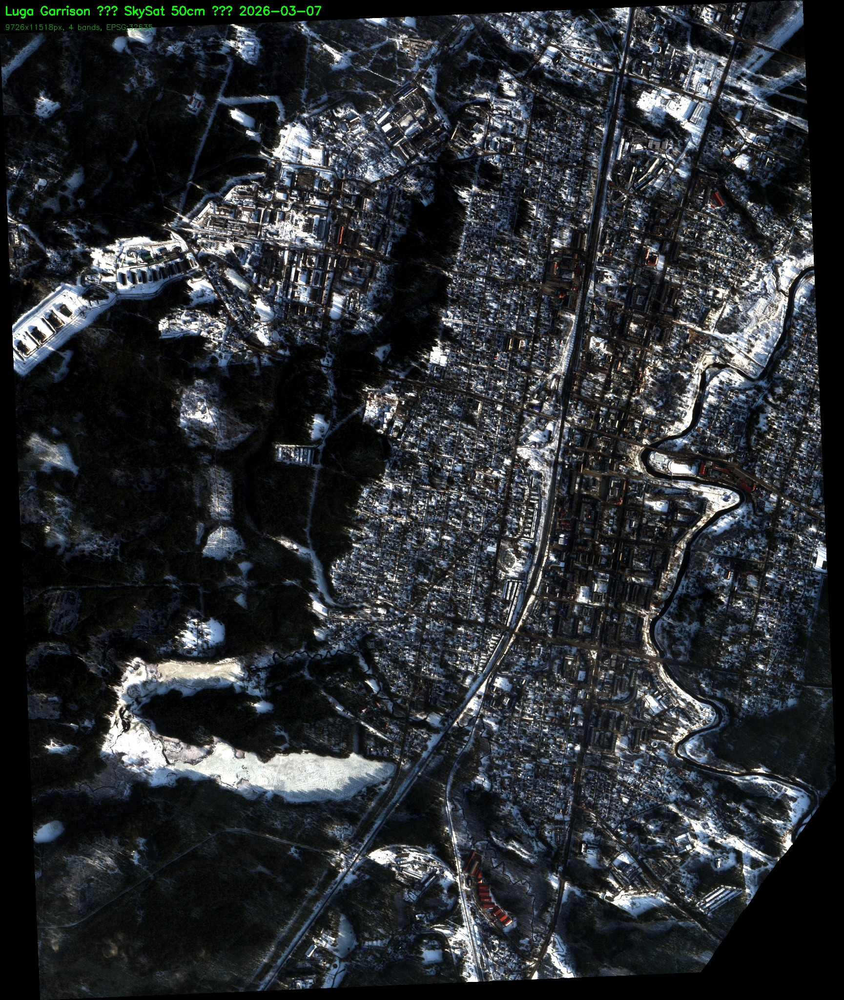

*SkySat scene of Luga garrison area — home base for the 26th Rocket Brigade (Iskander-M), 9th Guards Artillery Brigade, and elements of the 68th MR Division. [Yle reported](https://yle.fi/a/74-20113407) equipment shipped from this garrison to Ukraine in October 2025.*

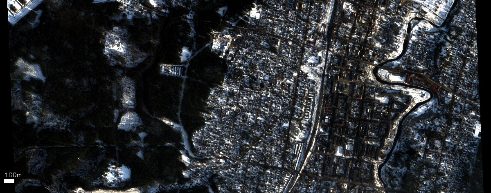

*Central garrison area. Snow-covered ground, scattered structures. 3 YOLO detections — all false positives (building roofs with shadows).*

### Detection Results

| Site | Sensor | GeoTIFF | Raw YOLO | After NMS | Verified Military | Verified Civilian | False Positive |
|------|--------|---------|:--------:|:---------:|:-:|:-:|:-:|
| Pskov 76th VDV | SkySat 50cm | 16,923 × 13,699 × 4 | 1 | 1 | **0** | 0 | 1 |
| Pskov Cherekha | WV3 35cm | 15,744 × 10,033 × 8 | 44 | 38 | **0** | 0 | 38 |
| Luga garrison | SkySat 50cm | 9,726 × 11,518 × 4 | 3 | 3 | **0** | 0 | 3 |
| **Total** | | | **48** | **42** | **0** | **0** | **42** |

All 42 post-NMS detections were classified as false positives by vision model + human review. Every detection crop is available in [`outputs/01-vehicle-detection/findings/`](outputs/01-vehicle-detection/findings/).

### Example False Positives

YOLO on COCO produces systematic false positives on satellite imagery — this is why vision model verification is critical:

| Crop | YOLO | Vision model | Actual |
|------|------|-------------|--------|
| 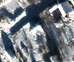 | car (0.32) | ~~MILITARY~~ → FP | Building roof + shadow |
| 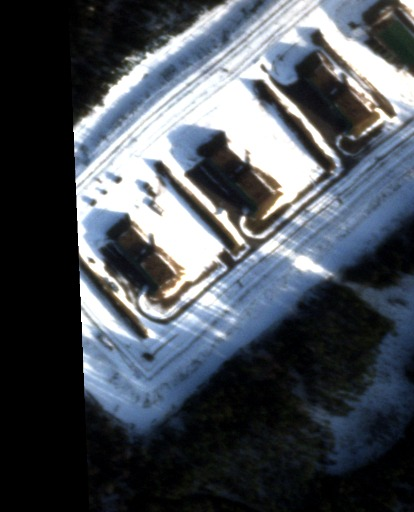 | car (0.58) | ~~MILITARY~~ → FP | Snow-covered building roofs |

*Qwen2.5-VL 7B initially misclassified these. Human review corrected both. This demonstrates multi-stage verification is essential — even vision models hallucinate on satellite crops.*

---

## Method 2: Spectral Analysis

**Notebook:** [`02-spectral-analysis.ipynb`](notebooks/02-spectral-analysis.ipynb)

Physics-based analysis using WorldView-3's 8 spectral bands. **No machine learning** — uses the physical properties of how metal, vegetation, concrete, and snow reflect different wavelengths.

### Spectral Index Overview

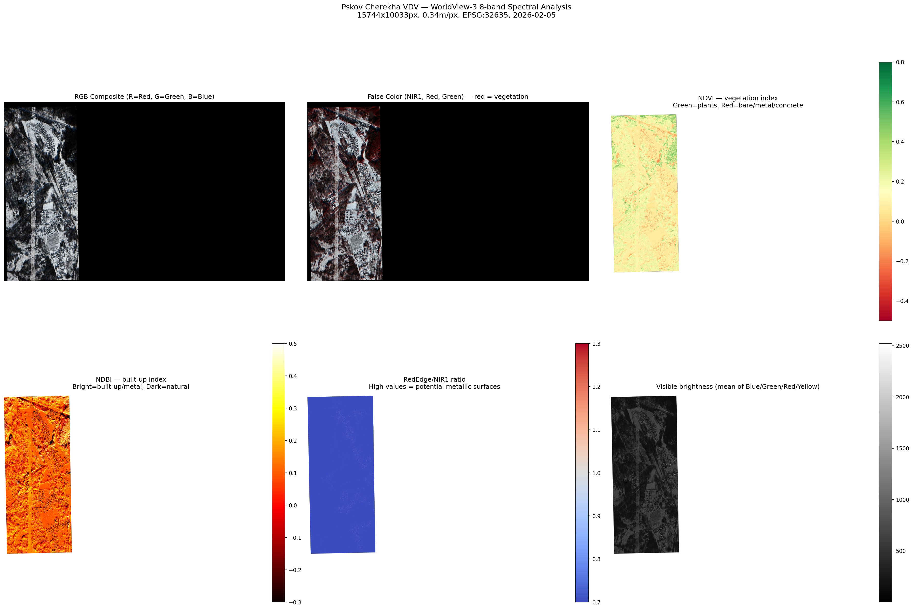

*Six views of the same scene. Top-left: true color RGB. Top-center: false color (NIR1/Red/Green — vegetation appears bright red). Top-right: NDVI ([formula](https://en.wikipedia.org/wiki/Normalized_difference_vegetation_index)). Bottom row: built-up index, RedEdge/NIR1 metal ratio, visible brightness.*

### Metal Detection

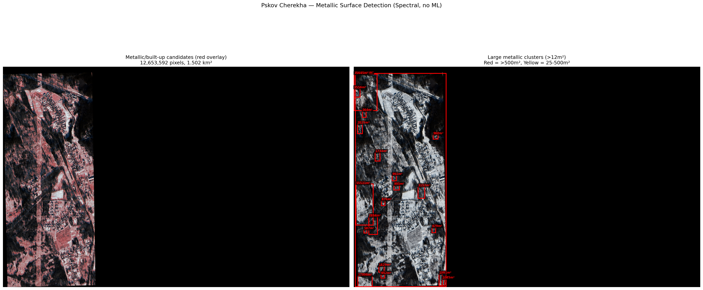

*Left: metallic/built-up candidate pixels (red overlay). Right: large clusters with bounding boxes and area labels. Red = >500m², Yellow = 25–500m².*

### Cluster Classification

The 10 largest metallic clusters are all **building roofs**:

| Crop | Area | Classification |
|------|------|---------------|
| 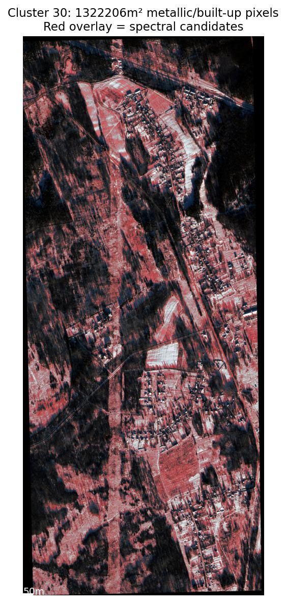 | 1,322,206 m² | Building complex (village) |
| 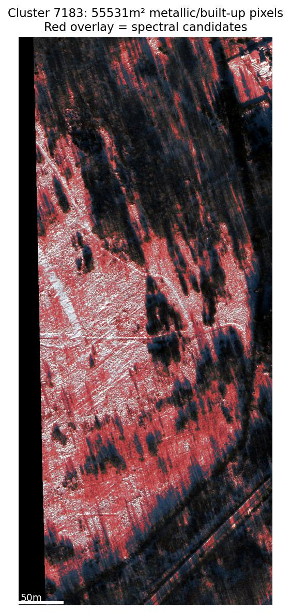 | 55,531 m² | Large building roof |
| 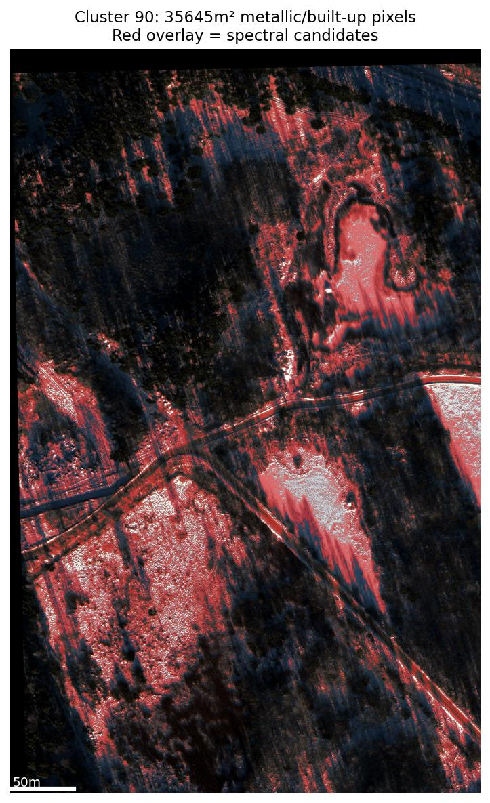 | 35,645 m² | Building cluster |

### Quantitative Assessment

| Metric | Value |
|--------|-------|
| Total metallic/built-up area | 1,489,004 m² (1.49 km²) |
| Building roofs (>200m² clusters) | 1,484,707 m² (99.7%) |
| Non-building metallic | **4,297 m²** (0.3%) |
| Max vehicle capacity (@ 37.5 m²/vehicle) | **114 vehicles** |

Even if **every non-building metallic pixel** were a military vehicle, the maximum possible count is 114 — far below the claimed 500–700. In reality, these pixels are fences, poles, small utility structures, and metallic debris.

---

## Method 3: SAR Radar Analysis

**Notebook:** [`03-sar-analysis.ipynb`](notebooks/03-sar-analysis.ipynb)

ICEYE Synthetic Aperture Radar — penetrates clouds, works at night, detects metallic returns. Two passes over Luga garrison (Jan 30 and Feb 5, 2026) enable temporal change detection.

### SAR Comparison


*Left: ICEYE SAR Jan 30. Center: ICEYE SAR Feb 5. Right: absolute change (bright = change). Minimal temporal change — no significant vehicle movement between passes.*

### Bright Target Detection

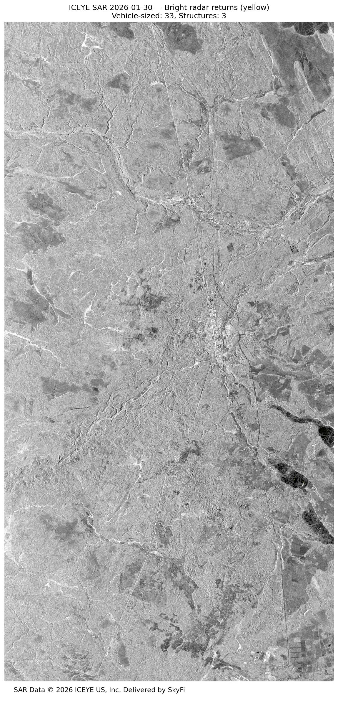
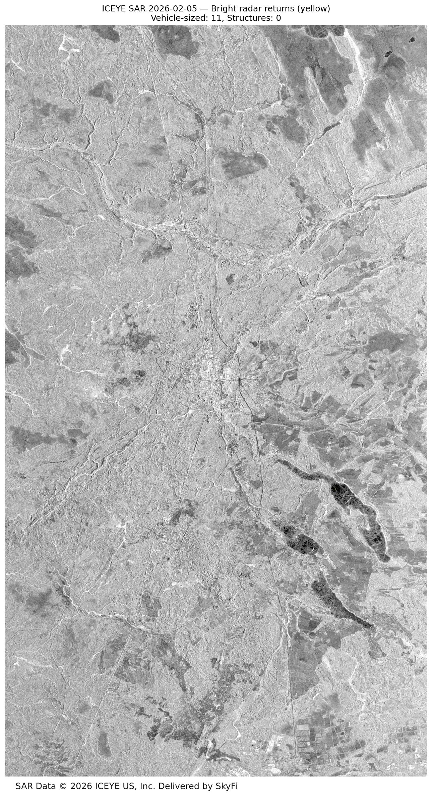

*Yellow overlay: bright radar returns (>3× local mean). All bright clusters are building-scale structures, not vehicle concentrations. At 2.5m/px, a tank (~4 pixels) cannot be reliably distinguished from small structures, but large vehicle formations (motor pools of 500+ vehicles) would produce unmistakable bright clusters — none detected.*

### SAR Findings

| Metric | Value |
|--------|-------|
| Temporal change (Jan 30 → Feb 5) | Minimal — no vehicle movement |
| Bright target clusters | Building-scale structures only |
| Vehicle-scale clusters | Not distinguishable at 2.5m/px |
| Large motor pool signatures | **None** |

---

## Unit Tracking (ISW / CDS)

Independent verification: every major LVO combat unit is confirmed deployed to Ukraine.

| Unit | Home Base | Current Location | Source |
|------|-----------|-----------------|--------|
| 76th Guards VDV Division | Pskov | Zaporizhia/Orikhiv — all 3 regiments | [ISW Mar 7](https://www.understandingwar.org/backgrounder/russian-offensive-campaign-assessment-march-7-2026) |
| 69th Guards MR Division | Kamenka | Kharkiv/Sumy — 83rd MRR at Vovchansk | [ISW Mar 22](https://www.understandingwar.org/backgrounder/russian-offensive-campaign-assessment-march-22-2026) |
| 68th MR Division | Vladimirsky Lager | Kupyansk — heavy losses | [ISW Mar 22](https://www.understandingwar.org/backgrounder/russian-offensive-campaign-assessment-march-22-2026) |
| 80th Arctic Brigade | Alakurtti | Sumy Oblast — seized Potapivka | [ISW Mar 22](https://www.understandingwar.org/backgrounder/russian-offensive-campaign-assessment-march-22-2026) |
| 44th Army Corps | Petrozavodsk | Kharkiv Oblast — skeleton formation | [ISW Jan 15](https://www.understandingwar.org/backgrounder/russian-offensive-campaign-assessment-january-15-2026) |
| 11th Army Corps elements | Kaliningrad | Kupyansk — 1431st + 352nd MRRs | [ISW Mar 22](https://www.understandingwar.org/backgrounder/russian-offensive-campaign-assessment-march-22-2026) |
| 26th Rocket Brigade (Iskander-M) | Luga | Equipment sent to Ukraine | [Yle Oct 2025](https://yle.fi/a/74-20113407) |

Full CSV: [`unit-tracking/lmd_units_march2026.csv`](https://github.com/Estwarden/dataset/blob/main/satellite-imagery/unit-tracking/lmd_units_march2026.csv)

---

## Corroborating Intelligence

| Source | Date | Finding | Link |
|--------|------|---------|------|
| Finnish OSINT / Yle | Jan 2026 | 50 trucks at Rybka, 2,500–3,000 troops in Karelia | [yle.fi](https://yle.fi/a/74-20113407) |
| Lithuanian VSD | Mar 2026 | 6–10 years for full NATO conflict readiness | [lrt.lt](https://www.lrt.lt/en/news-in-english/19/2859104/) |
| Lithuanian VSD | Mar 2026 | Limited Baltic conflict 1–2 years only if sanctions lifted | [stripes.com](https://www.stripes.com/theaters/europe/2026-03-09/lithuania-russia-threat-21003306.html) |
| Estonian intelligence | Jan 2026 | "No intention of attacking any NATO state" | [valisluureamet.ee](https://www.valisluureamet.ee/doc/raport/2026-en.pdf) |
| EstWarden Earth Engine | Daily | Pskov: LOW, Luga: LOW vehicles, Kamenka: LOW vehicles | [estwarden.eu](https://estwarden.eu) |

---

## Combined Assessment

```
┌─────────────────────────────────────────────────────────────────────┐
│                                                                     │
│   CLAIMED:   500–700 armored vehicles in Leningrad Military District│
│                                                                     │
│   DETECTED:  0 military vehicles (3 methods, 3 sites, 5 images)    │
│                                                                     │
│   MAXIMUM:   114 (spectral upper bound — includes buildings/debris) │
│                                                                     │
│   ISW/CDS:   ALL LVO combat units confirmed deployed to Ukraine    │
│                                                                     │
└─────────────────────────────────────────────────────────────────────┘
```

| What was checked | Result |
|-----------------|--------|
| Pskov VDV airfield — aircraft on apron | **0** |
| Pskov VDV airfield — vehicles in garrison | **0** |
| Pskov Cherekha — vehicles in garrison | **0** (38 FPs removed) |
| Luga — vehicles in garrison | **0** (3 FPs removed) |
| Cherekha — metallic surfaces (spectral) | 4,297 m² non-building (max 114 vehicles) |
| Luga — radar vehicle movement (Jan–Feb) | **None** |
| Luga — large motor pool signatures (SAR) | **None** |

---

## Reproducibility

All analysis is reproducible:

| Asset | Location |
|-------|----------|
| Satellite imagery | [Estwarden/dataset](https://github.com/Estwarden/dataset) |
| GeoTIFF payloads (open data) | In repo + [GitHub Release](https://github.com/Estwarden/dataset/releases) |
| Commercial imagery reproduction | [SkyFi](https://skyfi.com) archive IDs in [`orders.json`](https://github.com/Estwarden/dataset/blob/main/satellite-imagery/metadata/orders.json) |
| Notebook 01 — Vehicle detection | [`01-vehicle-detection.ipynb`](notebooks/01-vehicle-detection.ipynb) |
| Notebook 02 — Spectral analysis | [`02-spectral-analysis.ipynb`](notebooks/02-spectral-analysis.ipynb) |
| Notebook 03 — SAR analysis | [`03-sar-analysis.ipynb`](notebooks/03-sar-analysis.ipynb) |
| Unit tracking data | [`lmd_units_march2026.csv`](https://github.com/Estwarden/dataset/blob/main/satellite-imagery/unit-tracking/lmd_units_march2026.csv) |
| ISW daily assessments | [understandingwar.org](https://www.understandingwar.org/backgrounder/russian-offensive-campaign-assessment) |

**Requirements:** Python 3.10+, PyTorch, ultralytics, rasterio, opencv, scipy, matplotlib. GPU recommended for YOLO inference.

---

## Known Limitations

This analysis has real limitations that readers should understand:

1. **Object detection model scope.** YOLOv8x-OBB is trained on DOTA — a general satellite object detection dataset. It is NOT specifically trained on Russian military equipment (BTRs, BMPs, T-72/T-80/T-90, Iskander TELs, Il-76s). It detects generic categories (`large-vehicle`, `plane`, etc). A domain-specific model trained on Russian military equipment at these resolutions would be stronger evidence.

2. **Compressed imagery.** The publicly available images are 4096px JPGs downsampled from the original 16-bit GeoTIFFs (16,923×13,699 for Pskov SkySat). Individual vehicles at the downsampled resolution are ~2 pixels and may not be detectable. Vehicle **formations** (motor pools, runway equipment lines) would still be visible. The original GeoTIFFs were used for Round 1 analysis.

3. **Spectral analysis coverage.** The WorldView-3 scene covers the Cherekha settlement area south of Pskov — the garrison zone is partially covered but the dominant metallic signatures are civilian building roofs in the village. The "max 114 vehicles" upper bound includes all non-building metal including fences, poles, and utility structures.

4. **SAR resolution.** ICEYE SAR at 2.5m/px cannot reliably detect individual vehicles (~4 pixels). It CAN detect large motor pool formations (hundreds of vehicles create unmistakable bright clusters) and detect movement between passes. None were found, but single-vehicle or small-group detection is below the resolution floor.

5. **Temporal scatter.** Imagery spans 6 weeks: WorldView-3 Feb 5, SAR Jan 30 + Feb 5, SkySat Mar 7 + Mar 14. This is not a single-day coherent snapshot. Equipment could theoretically move between acquisition dates.

6. **The visual evidence is the primary evidence.** At 50cm resolution, an empty runway is obviously empty. The object detection and spectral analysis are supplementary quantitative methods. The qualitative visual assessment — empty aprons, empty vehicle parks, deserted garrison areas — is what any GEOINT analyst would see first.

---

## Attribution

- Imagery: [Planet](https://www.planet.com/) / [Maxar](https://www.maxar.com/) / [ICEYE](https://www.iceye.com/) via [SkyFi](https://skyfi.com)
- Open data: [ESA Copernicus](https://dataspace.copernicus.eu/) / [ICEYE](https://www.iceye.com/) free tier
- Unit tracking: [ISW](https://www.understandingwar.org/) / [CDS](https://defence.org.ua/)
- Analysis: [EstWarden](https://estwarden.eu) ([GitHub](https://github.com/Estwarden))
