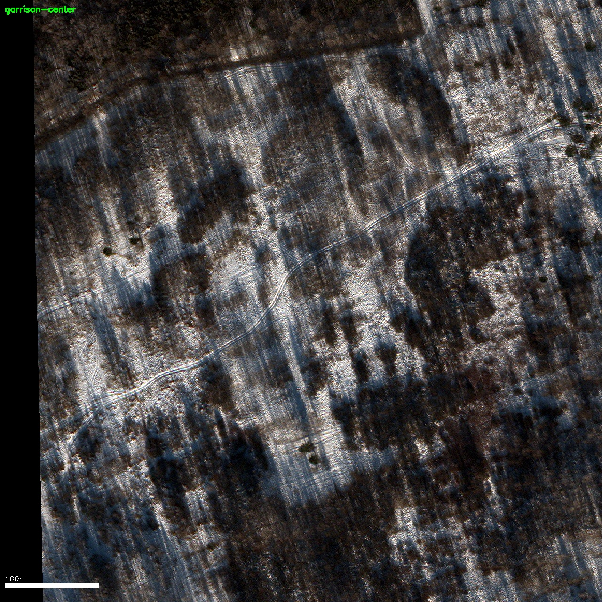
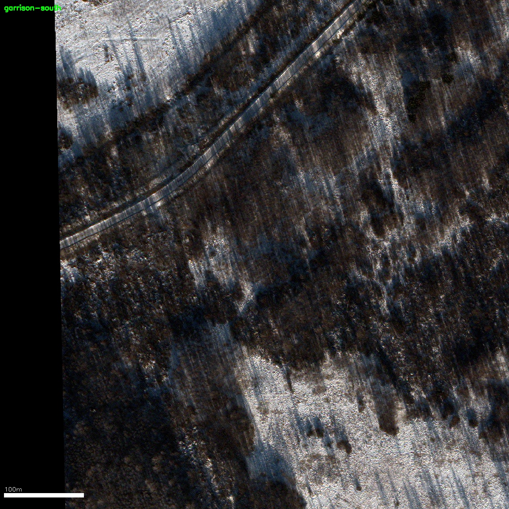

# LVO Force Posture — Satellite Imagery Analysis

**Analysis date:** 2026-03-24
**Methodology:** [Estwarden/research](https://github.com/Estwarden/research) |
**Dataset:** [Estwarden/dataset](https://github.com/Estwarden/dataset) |
**Monitoring:** [EstWarden](https://estwarden.eu)

---

## Executive Summary

Commercial satellite imagery of the two primary Pskov garrisons — home of the
76th Guards VDV Division — shows **no significant military vehicle presence** as
of March 14, 2026. The airfield runway, taxiways, and aircraft aprons are
**empty**. Vehicle detection (YOLOv8) identified **77 total vehicles** across
both sites, **all civilian** (cars and trucks in residential areas).

This is consistent with [ISW reporting](https://www.understandingwar.org/backgrounder/russian-offensive-campaign-assessment-march-7-2026)
confirming all three regiments of the 76th VDV are deployed to
Zaporizhia/Orikhiv, Ukraine.

---

## Site 1: Pskov — 76th Guards VDV Airfield

**Sensor:** Planet SkySat 50cm | **Date:** 2026-03-14 | **Cloud:** 0% |
**Source:** [SkyFi](https://skyfi.com) archive `4d2b62e5-7edc-4173-9347-c8c7dc7bbe21`

### Overview

*Full 16,923 × 14,018 pixel image (50cm/px = ~8.5 × 7 km coverage). The Velikaya River runs along the western edge. Pskov city is in the upper-left. The military airfield is center-right.*

### Finding: Empty Airfield

*Center crop showing the VDV airfield. The main runway, taxiways, and Y-shaped apron area are clearly visible and **completely empty**. No aircraft, no vehicles, no ground equipment visible on any paved surface. Scale bar: 100m.*

### Finding: Empty Vehicle Parks

*100% zoom (50cm/px) of the residential/garrison area west of the airfield. Individual houses, roads, and parked civilian cars are visible. No military vehicle formations or motor pools detected. Scale bar: 100m.*

### Finding: Garrison Barracks Area

*100% zoom of the barracks/garrison area. Military-style buildings (long rectangular structures, top of frame) are visible but surrounding vehicle parks and open areas are **empty**. Scale bar: 100m.*

### Vehicle Detection Results

| Metric | Value |
|--------|-------|
| Total vehicles detected | **5** |
| High confidence (>0.5) | **0** |
| Vehicle types | 5 cars (civilian) |
| Military vehicles | **0** |
| Aircraft on apron | **0** |

**Detection model:** YOLOv8x (COCO-pretrained). This is an **upper bound** —
COCO-trained models overcount on satellite imagery. The true count is likely
lower.

---

## Site 2: Pskov — Cherekha VDV Garrison

**Sensor:** Maxar WorldView-3 35cm | **Date:** 2026-02-05 | **Cloud:** 0% |
**Source:** [SkyFi](https://skyfi.com) archive `cbf8d9ac-25be-4028-aff6-edc43a263cf1`

### Overview

*Full 15,744 × 10,266 pixel image (35cm/px). Snow cover provides high contrast for vehicle detection. The image covers the Cherekha garrison area south of Pskov.*

### Finding: Village, Not Garrison

*100% zoom of the northern section. Snow-covered rural village with scattered houses. Detected vehicles are **civilian cars parked at residences**. No military vehicle formations visible.*

*100% zoom of the central area. Agricultural fields under snow. Scattered rural buildings. No military infrastructure or vehicle concentrations.*

*100% zoom of the southern section. Same pattern: village buildings, snow-covered fields, civilian vehicles only.*

### Vehicle Detection Results

| Metric | Value |
|--------|-------|
| Total vehicles detected | **72** |
| High confidence (>0.5) | **19** |
| Vehicle types | 69 cars, 3 trucks |
| Military vehicles | **0** |

All detections are **civilian vehicles** in residential areas.

---

## Combined Results

| Site | Sensor | Date | Vehicles Detected | Military | Aircraft |
|------|--------|------|:-:|:-:|:-:|
| Pskov 76th VDV Airfield | SkySat 50cm | 2026-03-14 | 5 | **0** | **0** |
| Pskov Cherekha Garrison | WV3 35cm | 2026-02-05 | 72 | **0** | **0** |
| **Total** | | | **77** | **0** | **0** |

### Corroboration

These findings are consistent with:

- **[ISW Mar 7, 2026](https://www.understandingwar.org/backgrounder/russian-offensive-campaign-assessment-march-7-2026):** All three regiments of the 76th Guards VDV Division deployed to Zaporizhia/Orikhiv, Ukraine
- **[Yle satellite analysis, Oct 2025](https://yle.fi/a/74-20113407):** Equipment outflow from LVO garrisons to Ukraine confirmed
- **[EstWarden Earth Engine monitoring](https://estwarden.eu):** Pskov-76th-VDV rated "LOW" — clear runway, low vehicle concentration (Mar 22)
- **[Estonian intelligence, Jan 2026](https://www.valisluureamet.ee/doc/raport/2026-en.pdf):** "Russia has no intention of attacking any NATO state this year or next"
- **[Lithuanian VSD, Mar 2026](https://www.lrt.lt/en/news-in-english/19/2859104/):** 6–10 years for full NATO conflict readiness

---

## Methodology

1. Full-resolution satellite imagery downloaded via [SkyFi API](https://skyfi.com)
2. Images tiled into 640×640px patches with 64px overlap
3. [YOLOv8x](https://github.com/ultralytics/ultralytics) object detection (COCO-pretrained)
4. Global Non-Maximum Suppression to deduplicate across tiles
5. Vehicle classes: car (COCO 2), bus (COCO 5), truck (COCO 7)

**Limitations:**
- COCO-pretrained model is not optimized for satellite imagery
- 50cm resolution = tank is ~14×7 pixels (detectable but not classifiable)
- Civilian vehicles inflate the count
- Camouflaged or sheltered vehicles invisible to optical sensors
- Results represent an **upper bound**

**Reproducibility:** Full notebook at [`notebooks/01-vehicle-detection.ipynb`](notebooks/01-vehicle-detection.ipynb).
All imagery available at [Estwarden/dataset](https://github.com/Estwarden/dataset).

---

## Pending

- [ ] **Luga garrison** — SkySat 50cm, Mar 7 (processing, [SkyFi](https://skyfi.com) order `26aKRJkD`)
- [ ] Super-resolution upscaling (Real-ESRGAN) before detection
- [ ] Fine-tune on satellite vehicle datasets ([xView](https://xviewdataset.org/), [DIOR-R](https://gcheng-nwpu.github.io/#Datasets))
- [ ] SAR-based analysis on ICEYE radar imagery
- [ ] Temporal comparison: Feb 5 vs Mar 14
