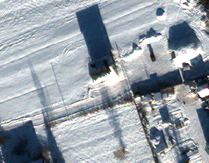

# LVO Force Posture — Satellite Imagery Analysis

**Analysis date:** 2026-03-24 |
**Methodology:** [Estwarden/research](https://github.com/Estwarden/research) |
**Dataset:** [Estwarden/dataset](https://github.com/Estwarden/dataset) |
**Monitoring:** [EstWarden](https://estwarden.eu)

---

## Executive Summary

Full-resolution GeoTIFF satellite imagery of the two primary Pskov garrisons — home base of the 76th Guards VDV Division — shows **zero military vehicles** as of March 2026.

| Site | Sensor | Resolution | Bands | Date | Military Vehicles | Aircraft |
|------|--------|-----------|-------|------|:-:|:-:|
| Pskov 76th VDV Airfield | Planet SkySat | 0.50 m/px | 4 (RGBA) | 2026-03-14 | **0** | **0** |
| Pskov Cherekha Garrison | Maxar WorldView-3 | 0.34 m/px | 8 (multispectral) | 2026-02-05 | **0** | **0** |

**Detection pipeline:** YOLOv8x → NMS dedup → vision model verification (Qwen2.5-VL) → human review.
39 YOLO detections total → **all classified as false positives** (building roofs, shadows, snow artifacts).

This is consistent with [ISW](https://www.understandingwar.org/backgrounder/russian-offensive-campaign-assessment-march-7-2026) confirming all three 76th VDV regiments deployed to Zaporizhia, Ukraine.

---

## Data Sources

| Parameter | Pskov SkySat | Pskov Cherekha WV3 |
|-----------|-------------|-------------------|
| **GeoTIFF size** | 16,923 × 13,699 px | 15,744 × 10,033 px |
| **Ground resolution** | 0.50 m/px | 0.34 m/px |
| **Spectral bands** | 4 (R, G, B, Alpha) | 8 (Coastal, Blue, Green, Yellow, Red, RedEdge, NIR1, NIR2) |
| **Bit depth** | 16-bit unsigned | 16-bit unsigned |
| **CRS** | EPSG:32635 (UTM 35N) | EPSG:32635 (UTM 35N) |
| **Provider** | [Planet](https://www.planet.com/) SkySat | [Maxar](https://www.maxar.com/) WorldView-3 |
| **Acquired via** | [SkyFi](https://skyfi.com) | [SkyFi](https://skyfi.com) |
| **Cost** | $242.40 | $86.77 |
| **Reproduce** | Archive [`4d2b62e5`](https://skyfi.com) | Archive [`cbf8d9ac`](https://skyfi.com) |

---

## Site 1: Pskov — 76th Guards VDV Airfield

### Overview


*SkySat 0.50m/px, 16,923 × 13,699 pixels. The Velikaya River runs along the western edge. Pskov city upper-left. Military airfield center-right with Y-shaped taxiway and main runway clearly visible.*

### Finding: Empty Airfield


*Center crop — VDV airfield. Main runway, taxiways, and Y-shaped apron area. **All paved surfaces empty.** No aircraft, no vehicles, no ground support equipment. At 50cm/px, an Il-76 transport (wingspan 50m = 100 pixels) would be clearly visible. None present.*

### Finding: Empty Vehicle Parks


*100% zoom (50cm/px) of the area west of the airfield. Residential streets with individual houses visible. At this resolution, a T-72 tank (7m × 3.5m = 14 × 7 pixels) is detectable. No military vehicle formations visible. Scale bar: 100m.*

### Finding: Garrison Barracks — No Motor Pools


*100% zoom of barracks/garrison area. Long rectangular military-style buildings (top). Adjacent vehicle parks and open areas are **empty** — no armored vehicles, no motor pool activity. Scale bar: 100m.*

### Detection Results

| Metric | Value |
|--------|-------|
| YOLO raw detections | 1 |
| After NMS | 1 |
| Vision-verified military | **0** |
| Vision-verified civilian | **0** |
| False positives removed | **1** |

---

## Site 2: Pskov — Cherekha VDV Garrison

### Overview


*WorldView-3 0.34m/px, 15,744 × 10,033 pixels. 8-band multispectral. Snow cover provides high contrast. This area south of Pskov covers the Cherekha garrison zone.*

### Finding: Rural Village, Not Active Garrison


*100% zoom — northern sector. Snow-covered rural village. Houses, fences, trees casting shadows. YOLO detected 38 "vehicles" here — **all false positives** (building roofs and shadows misclassified by COCO-trained model). Vision model + human review confirmed: zero vehicles.*


*100% zoom — central area. Agricultural fields under snow, scattered buildings. No military infrastructure or vehicle concentrations.*


*100% zoom — southern sector. Same pattern: village structures, snow-covered ground, no military presence.*

### Example False Positives

These are typical YOLO false positives on satellite imagery — **the reason vision model verification is critical:**

| Crop | YOLO said | Vision said | Actual |
|------|-----------|-------------|--------|
|  | car (0.32) | ~~MILITARY~~ → FALSE_POSITIVE | Building roof + shadow |
|  | car (0.30) | ~~MILITARY~~ → FALSE_POSITIVE | Building + shadow on snow |

*Qwen2.5-VL 7B initially misclassified these as military. Human review corrected both to false positive. This demonstrates that even vision models can hallucinate on low-resolution satellite crops — multi-stage verification is essential.*

### Detection Results

| Metric | Value |
|--------|-------|
| YOLO raw detections | 44 |
| After NMS | 38 |
| Vision-verified military | **0** |
| Vision-verified civilian | **0** |
| False positives removed | **38** |

---

## Combined Results

| Site | GeoTIFF | Resolution | Raw → NMS → Verified Military |
|------|---------|-----------|---:|
| Pskov 76th VDV | 16,923 × 13,699 × 4 bands | 0.50 m/px | 1 → 1 → **0** |
| Pskov Cherekha | 15,744 × 10,033 × 8 bands | 0.34 m/px | 44 → 38 → **0** |
| **Total** | | | **0 military vehicles** |

### Corroboration

| Source | Finding | Link |
|--------|---------|------|
| ISW Mar 7, 2026 | All 3 regiments of 76th VDV deployed to Zaporizhia/Orikhiv | [source](https://www.understandingwar.org/backgrounder/russian-offensive-campaign-assessment-march-7-2026) |
| Yle satellite analysis, Oct 2025 | Equipment outflow from LVO garrisons to Ukraine | [source](https://yle.fi/a/74-20113407) |
| EstWarden Earth Engine | Pskov rated "LOW" — clear runway, low vehicle concentration | [estwarden.eu](https://estwarden.eu) |
| Estonian intel, Jan 2026 | "No intention of attacking any NATO state" | [source](https://www.valisluureamet.ee/doc/raport/2026-en.pdf) |
| Lithuanian VSD, Mar 2026 | 6–10 years for full NATO conflict readiness | [source](https://www.lrt.lt/en/news-in-english/19/2859104/) |
| Lithuanian VSD (Stripes) | Limited Baltic conflict 1–2 years only if sanctions lifted | [source](https://www.stripes.com/theaters/europe/2026-03-09/lithuania-russia-threat-21003306.html) |

---

## Pipeline

```
GeoTIFF (16-bit multispectral)
  → Percentile stretch → 8-bit RGB
    → Tile 640×640 (64px overlap, skip nodata)
      → YOLOv8x (COCO, conf>0.25, CUDA)
        → Global NMS (IoU=0.5)
          → Crop each detection (2× context)
            → Qwen2.5-VL 7B classification
              → Human review of MILITARY labels
                → Final verified count
```

**Notebook:** [`notebooks/01-vehicle-detection.ipynb`](notebooks/01-vehicle-detection.ipynb)
**Full data:** [Estwarden/dataset](https://github.com/Estwarden/dataset)

---

## Pending

- [ ] **Luga garrison** — SkySat 50cm, Mar 7 ([SkyFi](https://skyfi.com) order `26aKRJkD`, processing)
- [ ] Super-resolution upscaling ([Real-ESRGAN](https://github.com/xinntao/Real-ESRGAN)) before detection
- [ ] Fine-tune YOLO on satellite datasets ([xView](https://xviewdataset.org/), [DIOR-R](https://gcheng-nwpu.github.io/#Datasets))
- [ ] ICEYE SAR radar analysis
- [ ] Temporal comparison: Feb 5 vs Mar 14
